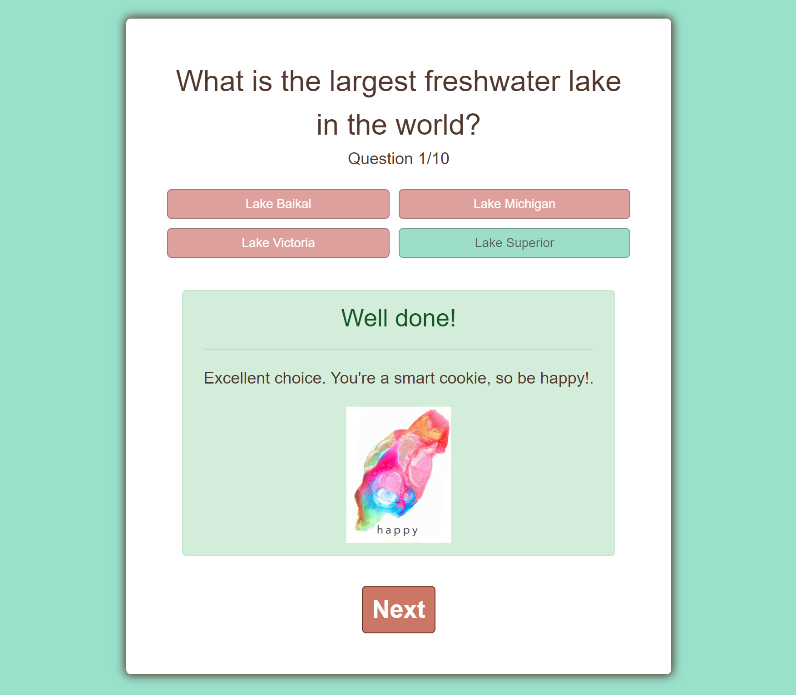
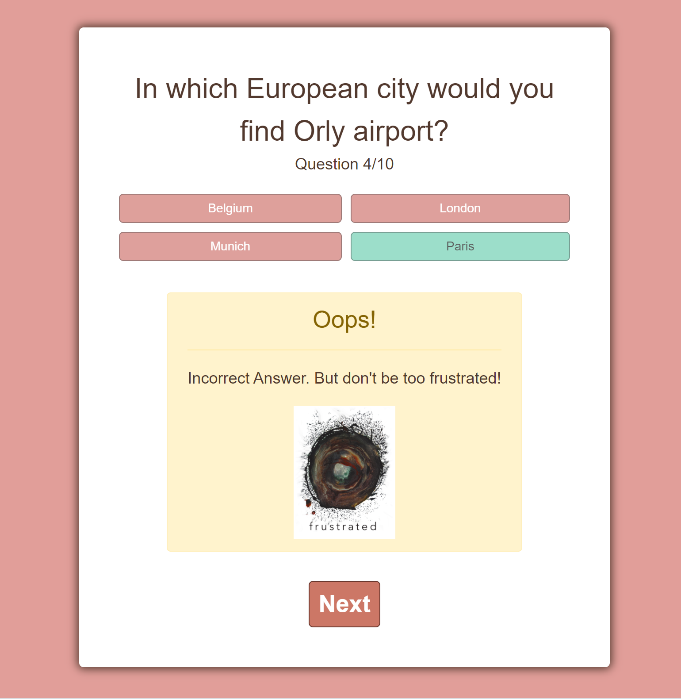
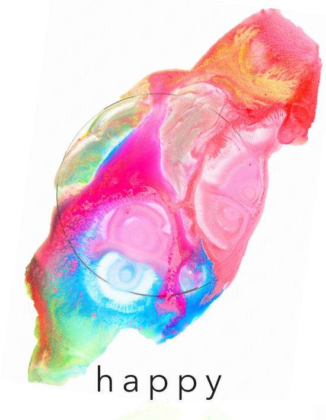

# TriviaGame

Trivia Game is an app created for the Tandem Apprenticeship coding challenge. 





Rules of the challenge: 

"Your goal is to create an application that displays trivia questions with multiple-choice answers to select
from."

Assumptions
• A round of trivia has 10 Questions
• All questions are multiple-choice questions
• Your score does not need to update in real time
• Results can update on form submit, button click, or any interaction you choose
• We will provide you with the trivia data such as the questions, correct and incorrect answers via a
JSON file

Acceptance Criteria

• A user can view questions.
• Questions with their multiple choice options must be displayed one at a time.
• Questions should not repeat in a round.
• A user can select only 1 answer out of the 4 possible answers.
• The correct answer must be revealed after a user has submitted their answer
• A user can see the score they received at the end of the round


## Installation

Clone the app from github.
After cloning, in your terminal do the following: 

```bash
npm install
```
To start the application, run the following command in main directory:

```bash
serve
```

## Technologies Used

[Bootstrap](https://reactjs.org/)

[Jest](https://reactstrap.github.io/) for speedy styling


## Other Goodies

## ERD

## Sarah Hart Art Info

All art is mine. See more at [Sarah Hart Art](https://sarahhartlandolt.com/)